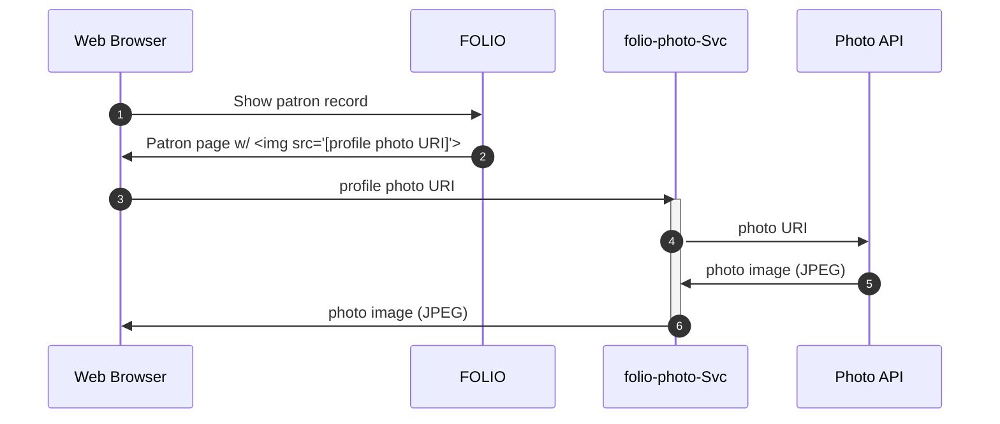

# folio-photo-svc
Web service to broker access from FOLIO to photos.

## Profile photo request sequence
This diagram illustrates how a request from the FOLIO UI for a profile
photo is fulfilled.

```mermaid
sequenceDiagram
    autonumber

    participant Browser as Web Browser
    participant FOLIO as FOLIO
    participant Svc as folio-photo-Svc
    participant pAPI as Photo API
    
    Browser->>FOLIO: Show patron record
    FOLIO->>Browser: Patron page w/ <img src="[profile photo URI]">
    Browser->>Svc: profile photo URI
    activate Svc
    Svc->>pAPI: photo URI
    pAPI->>Svc: photo image (JPEG)
    Svc->>Browser: photo image (JPEG)
    deactivate Svc
```
